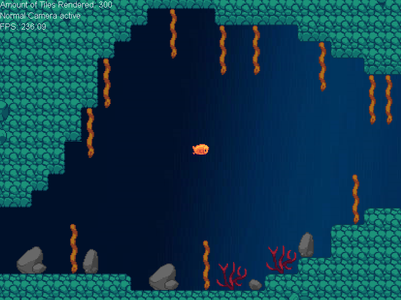
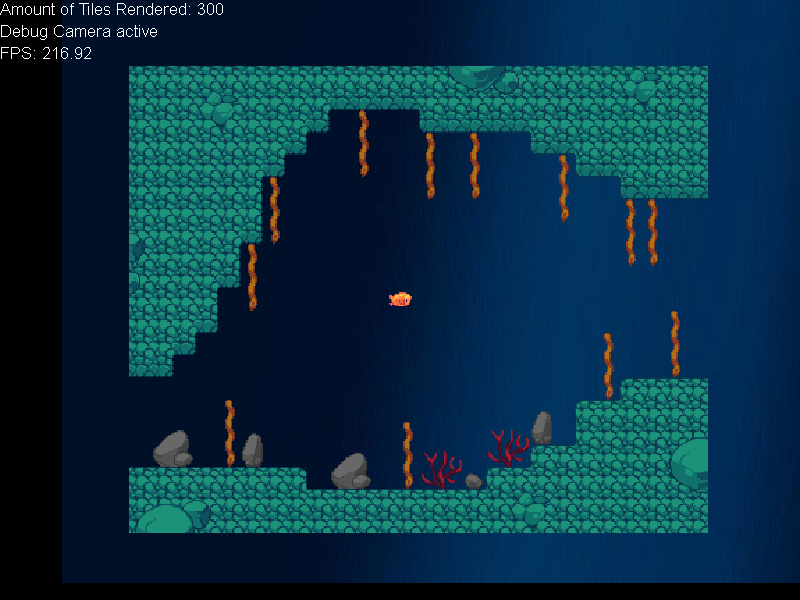

# Orchid-2D-Engine (2014)

 
Game Engine Prototype.

## Table of Contents
  - [General Information](#general-information)
  - [Technologies Used](#technologies-used)
  - [How To Run](#how-to-run)
  - [How to Compile](#how-to-compile)
  - [Illustrations](#illustrations)
  - [Features](#features)
  - [Sources](#sources)

## General Information
This is a game engine playground I developped in 2014. It features:
- Music using ogg-files 
- 2D Tile-Based levels created in Tiled, imported using as xml
- Simple tile-based renderer using DirectX 9.0c
- Keyboard, mouse and gamepad support using Direct Input.

**Note**: The engine is quite old (from 2014) and does not truly represent my current skillset for designing and implementing C++ code. It was uploaded and published to show my previous work as part of my résumé.

## Technologies Used
- [tinyxml2](https://github.com/leethomason/tinyxml2)
- [libogg](https://xiph.org/ogg/)
- [libvorbis](https://xiph.org/vorbis/)

## How To Run
1. Requirements:
- [C++ Redistributable 2022 (v143)](https://docs.microsoft.com/en-us/cpp/windows/latest-supported-vc-redist?view=msvc-170)

2. Compiled binary:

    A compiled binary can be found in `snapshot`. It requires the `data` to be in the same directory as the executable.

## How to Compile
1. Requirements:
- [Visual Studio Community](https://visualstudio.microsoft.com/de/downloads/)
  - Choose workloads: `Desktop development with C++` and `Game Development with C++`.
- [DirectX SDK 2010](https://www.microsoft.com/en-us/download/details.aspx?id=6812)

2. Solution:

    The solution found in the root directory can be used to compile the project and all of it's requirements.

## Illustrations
### 2D Rendering
Rendering of a 2D level loaded from an .xml file.

### 2D Rendering: Culling
Using a debug camera to show tile-culling to improve performance.

## Features
### 2D Tile-Based Renderer
The level was created using assets from Deep Blue Home and with a program called Tiled [see sources](#sources). Tiled can export to an .xml file format. [tinyxml2](https://github.com/leethomason/tinyxml2) was used to load the xml file and to build an in-memory representation of the entire level in the engine. Interactive characters, like the player, are inserted into the tilemap and automatically rendered. The map supports multiple layers: A background image, background tiles, objects (player) and foreground tiles. It uses tilesets as a single texture for multiple tiles. The current version renders each tile individually, which results in visible seams between tiles. Batch Rendering of interactive tiles (like player and enemies) and a singular 2D-grid mesh would alleviate these problems and improve the performance further.

### Music/Sound playback with .ogg support
To allow playback of music and soundeffects, .ogg files were used. The libvorbis library is used to load and decompress chunks of an .ogg file into uncompressed waveform in memory. DirectSound allocates a ringbuffer for sound. The engine uses a sound subsystem that holds every currently loaded soundfile as an "OGG-Player". Every frame the ring-buffer pointers are checked. If the hardware has advanced far enough into playback the usable space of the ringbuffer is filled, and returned back to hardware. A simple system that allows for multiple sound-files to be played.

## Sources
- [Ludum Dare 29: Deep Blue Home by Jools64](https://web.archive.org/web/20170703054547/http://www.ludumdare.com/compo/ludum-dare-29/?action=preview&uid=17060): Used some of the assets for testing. A playable version of Deep Blue Home can still be found at [Newgrounds](https://www.newgrounds.com/portal/view/638327)
- [Tiled](https://www.mapeditor.org/): Tiled Mapeditor was used to create the tilemap of the level.
